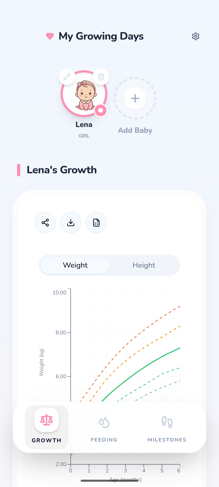
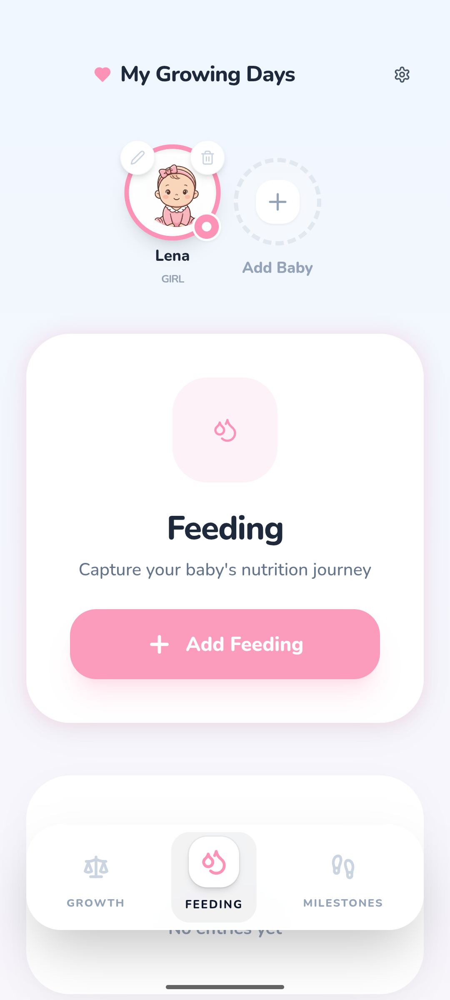
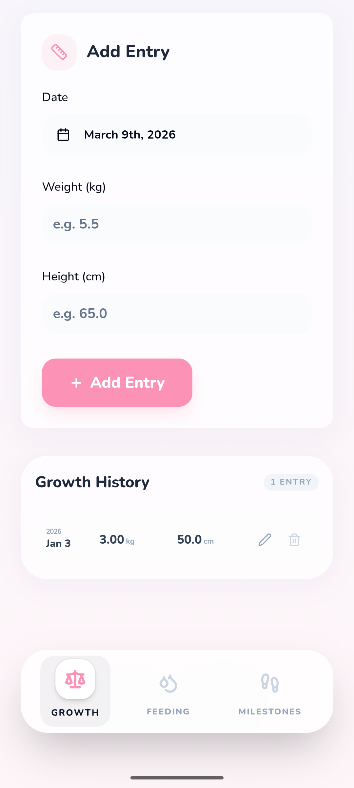
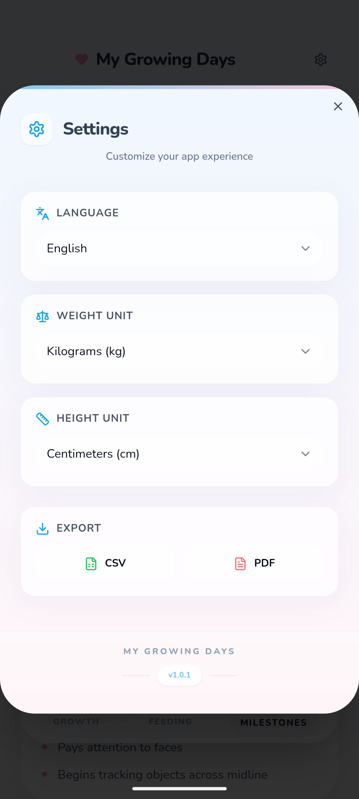
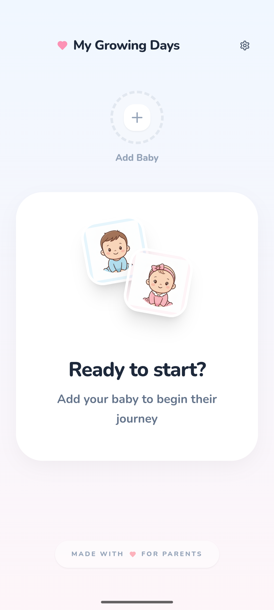
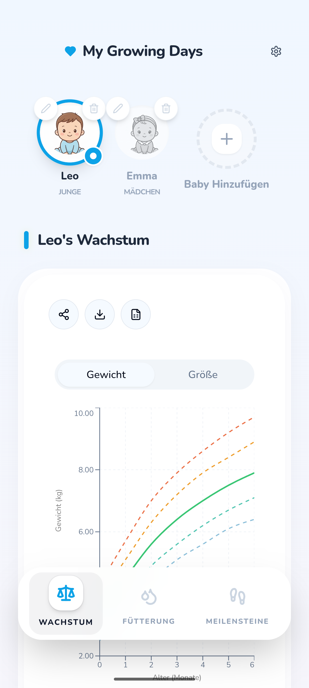

# My Growing Days (Android / Web App)

A modern, responsive web and mobile application for tracking and visualizing baby growth data (weight, height, head circumference). Built with React, TypeScript, and shadcn/ui, and powered by Capacitor for mobile.


## Screenshots

<div align="center">
  <table style="width: 100%;">
    <tr>
      <td align="center"><b>Dashboard</b></td>
      <td align="center"><b>Feeding</b></td>
      <td align="center"><b>Add Entry</b></td>
    </tr>
    <tr>
      <td></td>
      <td></td>
      <td></td>
    </tr>
    <tr>
      <td align="center"><b>Settings</b></td>
      <td align="center"><b>Onboarding</b></td>
      <td align="center"><b>Growth Curves</b></td>
    </tr>
    <tr>
      <td></td>
      <td></td>
      <td></td>
    </tr>
  </table>
</div>

## Visual Design

The app features a soft, modern, pastel-themed mobile UI designed for warmth and simplicity:

- **Color Palette**: Gentle pastel tones (blush pinks, muted blues) that dynamically adapt based on the child's gender.
- **Shapes & Layout**: Rounded elements, card-based design with subtle shadows, and a spacious layout for clarity.
- **Typography**: Friendly, clean sans-serif typography with a clear hierarchy for ease of use.
- **UI Elements**: Interactive Recharts graphs with WHO percentile curves and intuitive navigation.


## Target Audience

This application is designed for:
- **Parents and Caregivers**: To monitor and track their baby's physical development and feeding patterns easily.
- **Health-Conscious Families**: Who want to maintain a digital record of growth metrics to share with pediatricians.
- **International Users**: Supporting multiple languages and both metric/imperial unit systems.

## Features

- **Multi-Child Support**: Manage growth records for multiple babies in one place.
- **Interactive Charts**: Visualize weight, height, and head circumference trends with BMI and percentile curves (based on WHO standards).
- **Feeding Tracker**: Log milk feeding sessions (amount, time, and type).
- **Growth History**: Detailed logs for all growth metrics with easy editing and deletion.
- **Dynamic Themes**: Personalized experience with gender-based themes (Blue/Pink) and full Dark Mode support.
- **Data Export**: Export your data to CSV or PDF for backup or sharing with healthcare providers.
- **Internationalization**: Available in English, Spanish, French, and German.
- **Unit Flexibility**: Toggle between Metric (kg, cm, ml) and Imperial (lb, in, oz) units at any time.
- **Cross-Platform**: Seamless experience on Web and Android with an offline-first, private approach (all data stays on your device).


## Tech Stack

- **Framework**: [React](https://reactjs.org/) with [Vite](https://vitejs.dev/)
- **Language**: [TypeScript](https://www.typescriptlang.org/)
- **Mobile**: [Capacitor](https://capacitorjs.com/) (Android)
- **Styling**: [Tailwind CSS](https://tailwindcss.com/)
- **UI Components**: [shadcn/ui](https://ui.shadcn.com/)
- **Charts**: [Recharts](https://recharts.org/)
- **State Management**: [TanStack Query](https://tanstack.com/query)
- **Forms**: [React Hook Form](https://react-hook-form.com/) + [Zod](https://zod.dev/)
- **Testing**: [Vitest](https://vitest.dev/) + [React Testing Library](https://testing-library.com/)

## Getting Started

### Prerequisites

- Node.js (v18 or higher recommended)
- Android Studio (for mobile development)

### Web Development

1. Clone the repository:
   ```bash
   git clone <repository-url>
   cd baby-growth-chart
   ```

2. Install dependencies:
   ```bash
   npm install
   ```

3. Start the development server:
   ```bash
   npm run dev
   ```
   The application will be available at `http://localhost:5173`.

### Mobile Development (Android)

1. Build the web application:
   ```bash
      npm install
      npm install @capacitor/android
      npx capacitor-assets generate --android
      npm run build
      npx cap add android
      npx cap sync android
      npx cap open android
   ```


4. Run the app on an emulator or physical device.

### Generating Assets

To regenerate app icons and splash screens (requires `@capacitor/assets`):
```bash
npx capacitor-assets generate --android
```

## Available Scripts

- `npm run dev`: Starts the development server.
- `npm run assets:generate`: Generates app icons and splash screens.
- `npm run build`: Builds the application for production.
- `npm run preview`: Previews the production build locally.
- `npm run lint`: Runs ESLint to check for code quality issues.
- `npm run test`: Runs the test suite using Vitest.

## Project Structure

```
src/
├── components/     # Reusable UI components
│   ├── ui/         # primitive shadcn/ui components
│   └── ...         # Feature components (e.g., GrowthChart, SettingsControls)
├── data/           # Static data
├── hooks/          # Custom React hooks (useBabyData, useTranslation)
├── lib/            # Utility functions (conversions, export)
├── pages/          # Route-level pages
├── types/          # TypeScript definitions
└── test/           # Unit tests
android/            # Native Android project files
assets/             # Source assets for icons/splash
screenshots/        # App screenshots and marketing assets
```

## Privacy Policy

Your privacy is important to us. All data is stored locally on your device. For more details, see our full privacy policies:
- [English Privacy Policy](PRIVACY_POLICY_EN.md)
- [German Privacy Policy (Datenschutzerklärung)](PRIVACY_POLICY.md)

## License

This project is licensed under the MIT License - see the [LICENSE](LICENSE) file for details.
